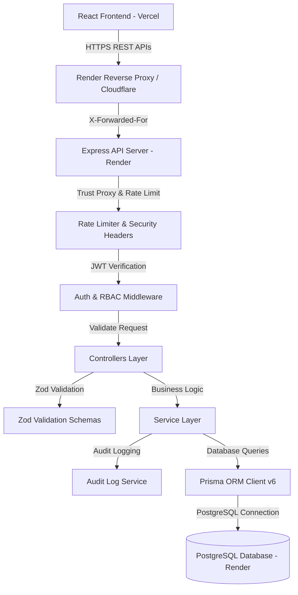
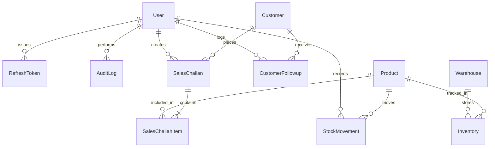
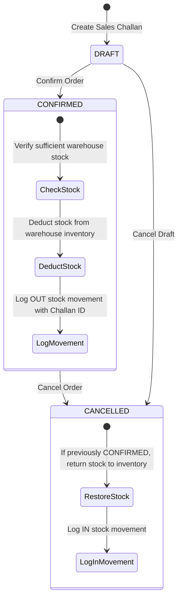

# Enterprise Mini ERP + CRM Operations Portal

A production-grade web application built for wholesale and distribution businesses to manage customer relationships (CRM), track warehouse stock, record follow-ups, manage sales challans with automated stock deduction, and handle role-based user access.

- **Backend API & Database**: Hosted on **Render** (Node.js + Express + Prisma ORM + PostgreSQL)
- **Frontend App**: Hosted on **Vercel** (React 18 + Vite + TypeScript + Tailwind CSS)

---

## 🔑 User Authentication & Registration

The application supports both **self-service user registration** with role assignment and **pre-configured demo user accounts**:

### 1. User Self-Registration
New users can register directly via the **`/register`** route or by toggling the **Register Account** tab on the login screen:
- **Full Name**
- **Work Email Address**
- **Password** (min 6 characters)
- **Role Selection**: Dropdown allowing users to choose their operational role (`ADMIN`, `SALES`, `WAREHOUSE`, `ACCOUNTS`).

Upon registration, the backend creates the user record with password hashing, logs an audit entry, and automatically authenticates the user into the portal dashboard under their selected role.

### 2. Pre-configured Demo Accounts

| Role | Email | Password | Allowed Capabilities |
| :--- | :--- | :--- | :--- |
| **Admin** | `admin@minierp.com` | `Admin123!` | Full superuser access, user management, audit logs, and record deletion |
| **Sales Exec** | `sales@minierp.com` | `Sales123!` | Manage customer CRM, log follow-up notes, and create sales challans |
| **Warehouse Lead** | `warehouse@minierp.com` | `Warehouse123!` | Manage product catalog, minimum stock alerts, and manual stock adjustments (`IN` / `OUT`) |
| **Accounts Manager** | `accounts@minierp.com` | `Accounts123!` | View financial summaries, inspect audit logs, and print invoices |

---

## 🛠️ Technology Stack & Architecture

### Backend Stack
- **Node.js** & **TypeScript** (Strongly typed backend API)
- **Express.js** (Modular architecture: controllers, services, middlewares, routes, validations)
- **Prisma ORM (v6 LTS)**:
  - Production Engine: PostgreSQL (`prisma/schema.postgres.prisma`) with native Enums (`Role`, `CustomerType`, `MovementType`, `ChallanStatus`)
  - Local Dev Engine: SQLite (`prisma/schema.prisma`)
- **Authentication & Security**:
  - **JWT Tokens**: Short-lived Access Tokens (15 min) & Revocable Refresh Tokens stored in DB (7 days)
  - **Bcryptjs**: Password hashing (10 salt rounds)
  - **Express Rate Limit**: Rate limiting (200 requests / 15 minutes window per IP)
  - **Reverse Proxy Trust**: `app.set('trust proxy', 1)` for Render / Cloudflare / Vercel compatibility
  - **Helmet**: Secure HTTP header configuration
  - **CORS**: Configurable cross-origin resource sharing (`CORS_ORIGIN`)
- **Validation & Logging**:
  - **Zod**: Input request body & schema validation
  - **Winston & Morgan**: Structured application logging & HTTP access logs
  - **Compression**: Gzip response payload compression

### Frontend Stack
- **React 18** & **TypeScript**
- **Vite** (Next-generation frontend build tool & dev server)
- **TanStack Query (React Query v5)** (Server state caching, optimistic updates & refetching)
- **Tailwind CSS** (Modern utility-first responsive styling)
- **Recharts** (Interactive executive dashboard charts)
- **Lucide Icons** (Clean UI iconography)

---

## 📐 System Architecture & Data Flow

### Architecture Overview



### Backend Directory Structure
```
backend/
├── prisma/
│   ├── schema.prisma           # Local SQLite schema for fast development
│   ├── schema.postgres.prisma  # Production PostgreSQL schema with native Enums
│   └── seed.ts                 # Database master data seeding script
├── src/
│   ├── config/                 # Environment variables and app configuration
│   ├── controllers/            # Request handlers and response formatters
│   ├── services/               # Core business logic (Stock deduction, CRM, Auth, Audit)
│   ├── validations/            # Zod validation schemas (Login, Register, Customer, Challan)
│   ├── middlewares/            # Auth, RBAC, Rate Limiting, Error Handling
│   ├── routes/                 # Express API routes (/auth, /customers, /products, /challans)
│   ├── utils/                  # JWT helpers, Logger, Standard API Response formatters
│   └── index.ts                # Server entry point & Express setup
├── Dockerfile                  # Production container definition
├── package.json                # Dependencies and deployment scripts
└── tsconfig.json               # TypeScript configuration
```

### Database Entity Relationships (ER Diagram)



---

## ⚙️ Core Business Workflows & Logic

### 1. Customer Relationship Management (CRM)
- Customer profiles with unique GST number and Email duplicate checks.
- Customer type categorization (`WHOLESALE`, `RETAIL`, `DISTRIBUTOR`).
- Follow-up notes logging with scheduled next follow-up dates.

### 2. Inventory & Stock Movement Engine
- Multi-warehouse inventory tracking (`productId` + `warehouseId` composite key).
- Manual stock movements (`IN` for stock entry, `OUT` for manual removal) with reason auditing.
- Automatic **Low Stock Warning**: Products at or below `minStock` threshold trigger red alert badges on the dashboard.

### 3. Sales Challan Lifecycle & Stock Deduction Logic



- **Draft State**: Prepare sales orders with multiple product line items. Stock is **not** deducted while in draft.
- **Price & Customer Snapshots**: Customer details and item prices are saved inside the challan record as a JSON snapshot upon creation, guaranteeing historical invoice integrity.
- **Confirmation State**: Server verifies stock availability. If stock is available, it deducts warehouse inventory and logs `OUT` stock movements. If stock is insufficient, confirmation is blocked with an error.
- **Cancellation State**: Cancelling a confirmed order automatically returns item quantities back to warehouse inventory and logs `IN` stock movements.

---

## 🔌 Complete API Documentation

### Base URLs
- **Local Development**: `http://localhost:5000/api`
- **Production Backend**: `https://<your-render-backend>.onrender.com/api`
- **Interactive Swagger Docs**: `http://localhost:5000/api-docs`

---

### 1. Authentication & Registration Endpoints

#### Register User
- `POST /api/auth/register` (Public)
- **Request Body**:
  ```json
  {
    "fullName": "Rahul Sharma",
    "email": "rahul@company.com",
    "password": "Password123!",
    "role": "SALES"
  }
  ```
- **Response**: `201 Created` with created user payload.

#### Login
- `POST /api/auth/login` (Public)
- **Request Body**:
  ```json
  {
    "email": "rahul@company.com",
    "password": "Password123!"
  }
  ```
- **Response**: `200 OK` with `user` object, `accessToken` (JWT 15 mins), and `refreshToken` (7 days).

#### Refresh Access Token
- `POST /api/auth/refresh`
- **Request Body**: `{ "refreshToken": "<refresh_token>" }`

#### Logout
- `POST /api/auth/logout`
- **Request Body**: `{ "refreshToken": "<refresh_token>" }`

#### Get Current User Profile
- `GET /api/auth/me` *(Requires JWT Bearer Token)*

---

### 2. Customer CRM Endpoints

- `GET /api/customers` — List customers with pagination (`page`, `limit`), `search`, and `customerType` filters.
- `POST /api/customers` *(Allowed Roles: `ADMIN`, `SALES`)* — Create customer profile.
- `GET /api/customers/:id` — Get customer details with follow-ups and order history.
- `PUT /api/customers/:id` *(Allowed Roles: `ADMIN`, `SALES`)* — Update customer details.
- `DELETE /api/customers/:id` *(Allowed Roles: `ADMIN`)* — Soft delete customer.
- `POST /api/customers/:id/followups` *(Allowed Roles: `ADMIN`, `SALES`)* — Log CRM follow-up.

---

### 3. Product & Inventory Endpoints

- `GET /api/products` — List products with `search` and `lowStock=true` filters.
- `POST /api/products` *(Allowed Roles: `ADMIN`, `WAREHOUSE`)* — Create product.
- `GET /api/inventory` — List inventory across warehouses.
- `POST /api/inventory/adjust` *(Allowed Roles: `ADMIN`, `WAREHOUSE`)* — Manual stock movement (`IN` / `OUT`).

---

### 4. Sales Challan Endpoints

- `GET /api/challans` — List sales challans with `status` filter (`DRAFT`, `CONFIRMED`, `CANCELLED`).
- `POST /api/challans` *(Allowed Roles: `ADMIN`, `SALES`)* — Create sales challan draft.
- `GET /api/challans/:id` — Get full challan details & line items.
- `PATCH /api/challans/:id/status` *(Allowed Roles: `ADMIN`, `SALES`, `WAREHOUSE`)* — Change status (Triggers stock deduction/restoration).

---

### 5. Dashboard & Security Audit Logs

- `GET /api/dashboard/summary` — Returns total revenue, customer count, low stock alert count, and monthly sales data.
- `GET /api/audit-logs` *(Allowed Roles: `ADMIN`, `ACCOUNTS`)* — Returns system audit trail with timestamps, user IDs, actions, and IP addresses.

---

## ⚡ Running Locally

### 1. Start Backend API
```bash
cd backend
npm install
npm run prisma:db:push
npm run prisma:seed
npm run dev
```
- Server starts at `http://localhost:5000/api`
- Swagger documentation available at `http://localhost:5000/api-docs`

### 2. Start Frontend Application
```bash
cd frontend
npm install
npm run dev
```
- App opens at `http://localhost:5173`

---

## 🐳 Docker Deployment (Local / VPS)

Run PostgreSQL, Express API, and React frontend using Docker Compose:

```bash
docker-compose up -d --build
```
- **Frontend**: `http://localhost`
- **Backend API**: `http://localhost:5000/api`
- **Swagger Docs**: `http://localhost:5000/api-docs`

---

## ☁️ Production Deployment Guide

### 1. Backend on Render

1. Create a **PostgreSQL Database** on Render (`minierp-postgres`). Copy the **Internal Database URL**.
2. Create a **Web Service** on Render connected to your repository:
   - **Root Directory**: `backend`
   - **Build Command**: `npm install && npm run render:build`
   - **Start Command**: `npm run render:start`
   - **Environment Variables**:
     - `NODE_ENV`: `production`
     - `PORT`: `10000`
     - `DATABASE_URL`: `<Render Internal Database URL>`
     - `JWT_ACCESS_SECRET`: `<Secret string>`
     - `JWT_REFRESH_SECRET`: `<Secret string>`
     - `CORS_ORIGIN`: `https://<your-vercel-app>.vercel.app`

### 2. Frontend on Vercel

1. Import your GitHub repository on Vercel.
2. Set **Root Directory** to `frontend`.
3. Set **Environment Variable**:
   - `VITE_API_BASE_URL`: `https://<your-render-backend-name>.onrender.com/api`
4. Click **Deploy**.

---

## 🧪 Comprehensive Quality Assurance Checklist

- [x] **User Self-Registration**: Test `/register` form. Register new users with custom roles (`SALES`, `WAREHOUSE`, `ACCOUNTS`, `ADMIN`).
- [x] **Auto-Login**: Verify registered user is immediately logged in and redirected to the dashboard.
- [x] **Role-Based Access Control (RBAC)**: Verify restricted pages (Audit Logs, Customer creation, Stock adjustment) enforce role permissions on both frontend and backend.
- [x] **Express Rate Limiting**: Verify 200 req/15 min IP rate limiter.
- [x] **Reverse Proxy Trust**: `app.set('trust proxy', 1)` handles `X-Forwarded-For` headers from Render reverse proxy without errors.
- [x] **Stock Deduction Engine**: Confirming a sales challan deducts stock. Attempting to confirm with insufficient stock returns error.
- [x] **Stock Restoration**: Cancelling a confirmed sales challan restores item quantities back to warehouse inventory.
- [x] **Historical Invoice Snapshots**: Verify editing customer or product master data does not alter existing challan snapshots.
- [x] **Low Stock Alerts**: Products with stock <= minStock highlight with red alert badges on dashboard and inventory pages.
- [x] **Audit Log Tracking**: Actions (user registration, login, logout, challan creation) are recorded in audit trail with IP address.

---

## 📄 License

This project is open-source under the MIT License.
