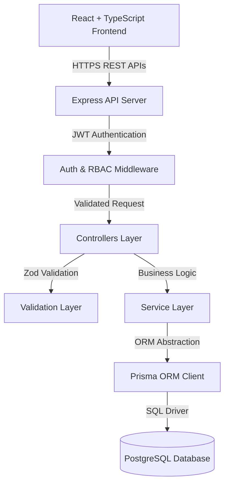
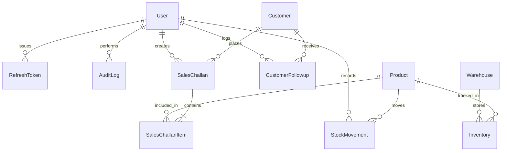
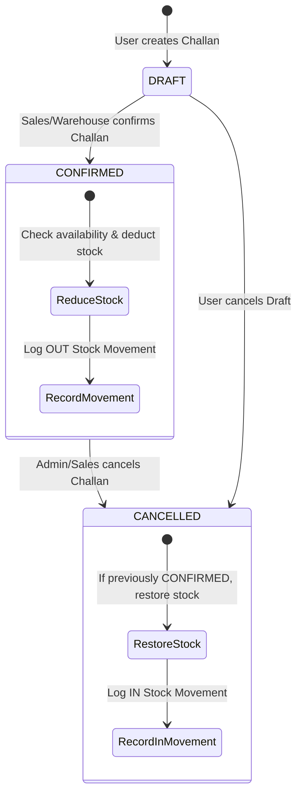

# Enterprise Mini ERP + CRM Operations Portal

A production-grade, full-stack Enterprise Mini ERP + CRM Portal built for wholesale and distribution operations.

Built with **Node.js, TypeScript, Express.js, PostgreSQL (Prisma ORM), React, Vite, Tailwind CSS, TanStack Query, Zod, and Docker**.

---

## 🔑 Pre-Configured Test Role Credentials

For instant evaluation, the database seed includes pre-configured accounts for all 4 roles:

| Role | Email | Password | Access Tier & Capabilities |
| :--- | :--- | :--- | :--- |
| **Admin** | `admin@minierp.com` | `Admin123!` | Full System Access, Audit Logs, Customer/Product Deletion |
| **Sales Exec** | `sales@minierp.com` | `Sales123!` | Customer CRM, Follow-up Notes, Draft/Confirmed Sales Challans |
| **Warehouse Lead**| `warehouse@minierp.com` | `Warehouse123!` | Manual Stock Adjustments (`IN`/`OUT`), Product Catalog & SKU Master |
| **Accounts** | `accounts@minierp.com` | `Accounts123!` | Financial Reports, Invoice Printing, Security & Audit Logs |

*Tip: Quick 1-click Demo buttons are built into the Login screen for instant evaluation!*

---

## 🛠️ Technology Stack

### Backend
- **Node.js (LTS)** & **TypeScript**
- **Express.js** with Clean Architecture (Controllers, Services, Middlewares)
- **PostgreSQL** (Production) / **SQLite** (Dev) & **Prisma ORM**
- **JWT** (jsonwebtoken) & **bcryptjs** (Access & Refresh Tokens)
- **Zod Schema Validation**
- **Helmet, CORS, Compression, Morgan & Rate Limiting**
- **Jest & Supertest** integration test suite

### Frontend
- **React 18** & **TypeScript**
- **Vite** bundler
- **TanStack Query (React Query v5)**
- **Tailwind CSS** with Modern Professional Clean design system
- **Recharts** analytics charts
- **Lucide Icons**

---

## 📐 System Architecture

### 1. Overview & Layering

The system is designed using **Clean Architecture** principles to support enterprise operations. It cleanly separates business domain logic from data access and transport protocols, ensuring high maintainability, testability, and scalability.



### Directory Structure
```
.
├── backend/
│   ├── prisma/
│   │   ├── schema.prisma            # SQLite Dev Schema
│   │   ├── schema.postgres.prisma   # Production PostgreSQL Schema
│   │   └── seed.ts                  # Master DB Seed Script
│   ├── src/
│   │   ├── config/                  # Environment config
│   │   ├── controllers/             # HTTP Controllers
│   │   ├── middlewares/             # JWT Auth, Roles, RateLimit, ErrorHandler
│   │   ├── routes/                  # Express REST Routes
│   │   ├── services/                # Business Domain Services
│   │   ├── utils/                   # Standardized Response, JWT, Logger
│   │   ├── validations/             # Zod Input Schemas
│   │   └── index.ts                 # Server Entrypoint
│   ├── tests/                       # Jest Integration Test Suite
│   ├── swagger.json                 # OpenAPI 3.0 Documentation
│   └── postman_collection.json      # Postman Collection
├── frontend/
│   ├── src/
│   │   ├── components/              # Layout, Navbar, Sidebar, Modals, StatCards
│   │   ├── context/                 # AuthContext
│   │   ├── pages/                   # Dashboard, Customers, Products, Inventory, Challans
│   │   ├── lib/                     # Axios API client with token interceptor
│   │   └── types/                   # TypeScript interfaces
├── docker-compose.yml               # Multi-container Docker configuration
└── README.md
```

### 2. Entity Relationship (ER) Diagram



### 3. Authentication & Authorization Flow

1. **Authentication**: Users log in via `POST /api/auth/login`. On verification, the server issues:
   - **Access Token**: Short-lived JWT (15 mins) carried in `Authorization: Bearer <token>` header.
   - **Refresh Token**: Long-lived token (7 days) stored in database and used via `POST /api/auth/refresh`.
2. **Role-Based Access Control (RBAC)**: Enforced via `authorizeRoles(...)` Express middleware.

### 4. Sales Challan Lifecycle & Stock Deduction Logic



- **Snapshot Preservation**: Customer details and unit prices are snapshot-stored inside the sales challan database record as JSON objects. This preserves historical financial and invoice integrity even if customer/product master data is edited later.

---

## 🔌 REST API Specification

### Base URL
- Local: `http://localhost:5000/api`
- Production: `https://<your-railway-app>.up.railway.app/api`
- Interactive Swagger OpenAPI Docs: `http://localhost:5000/api-docs`

### 1. Authentication Endpoints
- `POST /api/auth/login`
  - Body: `{ "email": "admin@minierp.com", "password": "Admin123!" }`
  - Returns: `{ "user": { ... }, "accessToken": "...", "refreshToken": "..." }`
- `POST /api/auth/refresh`
  - Body: `{ "refreshToken": "<token>" }`
- `POST /api/auth/logout`
  - Body: `{ "refreshToken": "<token>" }`

### 2. Customer CRM Endpoints
- `GET /api/customers` — Query params: `page`, `limit`, `search`, `customerType`, `status`.
- `POST /api/customers` — Roles: `ADMIN`, `SALES`. Body: `customerName`, `businessName`, `email`, `mobile`, `gstNumber`, `customerType`, `address`.
- `GET /api/customers/:id` — Customer profile + CRM interaction history.
- `PUT /api/customers/:id` — Update customer details.
- `POST /api/customers/:id/followups` — Add CRM follow-up note (`notes`, `nextFollowupDate`).

### 3. Product & Inventory Endpoints
- `GET /api/products` — Query params: `search`, `lowStock=true`.
- `POST /api/products` — Roles: `ADMIN`, `WAREHOUSE`. Create product master record.
- `PUT /api/products/:id` — Roles: `ADMIN`, `WAREHOUSE`. Update product master record.
- `GET /api/inventory` — Stock levels across warehouses.
- `POST /api/inventory/adjust` — Roles: `ADMIN`, `WAREHOUSE`. Body: `productId`, `warehouseId`, `quantity`, `movementType` (`IN`/`OUT`), `reason`.

### 4. Sales Challans Endpoints
- `GET /api/challans` — Query params: `page`, `limit`, `search`, `status`.
- `POST /api/challans` — Create Sales Challan with multiple items and snapshot payload.
- `GET /api/challans/:id` — View detailed challan & printable invoice layout.
- `PATCH /api/challans/:id/status` — Body: `{ "status": "CONFIRMED" }` or `{ "status": "CANCELLED" }`. (Deducts or restores stock atomically).

### 5. Audit & Dashboard Endpoints
- `GET /api/audit-logs` — Roles: `ADMIN`, `ACCOUNTS`.
- `GET /api/dashboard/summary` — Executive overview metrics & chart data.

---

## ⚡ Quick Start (Running Locally)

### Prerequisites
- Node.js (v18+)
- npm (v9+)

### 1. Backend Setup & Database Seeding

```bash
cd backend
npm install
npm run prisma:db:push
npm run prisma:seed
npm run dev
```
- Backend API will start at: `http://localhost:5000/api`
- Swagger Documentation available at: `http://localhost:5000/api-docs`

### 2. Frontend Setup

In a new terminal window:

```bash
cd frontend
npm install
npm run dev
```
- Frontend App will open at: `http://localhost:5173`

---

## 🐳 Docker Setup

Run the entire full-stack application (Frontend + Backend + PostgreSQL Database) with a single command:

```bash
docker-compose up -d --build
```

- **Frontend Portal**: `http://localhost`
- **Backend API**: `http://localhost:5000/api`
- **Swagger Docs**: `http://localhost:5000/api-docs`

---

## 🧪 Automated Testing & QA Verification Checklist

### Running Integration Tests
```bash
cd backend
npm test
```

### Manual QA Verification Matrix

#### 1. Authentication & Role Authorization
- [x] **Admin Login**: Test `admin@minierp.com` / `Admin123!`. Access full system.
- [x] **Sales Login**: Test `sales@minierp.com` / `Sales123!`. Access CRM & Challans.
- [x] **Warehouse Lead**: Test `warehouse@minierp.com` / `Warehouse123!`. Access Stock Adjustments.
- [x] **Accounts Manager**: Test `accounts@minierp.com` / `Accounts123!`. Access Audit Logs & Financials.
- [x] **Unauthenticated Access**: Direct route navigation to `/dashboard` redirects to `/login`.
- [x] **Token Refresh**: Automatic seamless token refresh when access token expires.

#### 2. Customer CRM Module
- [x] **Customer Creation**: Fill form with duplicate GST/Email; verify validation prevents duplicates.
- [x] **Search & Filter**: Search by business name, filter by Wholesale / Retail.
- [x] **CRM Follow-up**: Add follow-up note and verify scheduled date updates on timeline.
- [x] **Soft Delete**: Deleting a customer marks record as `isDeleted = true`.

#### 3. Product & Inventory Module
- [x] **Low Stock Indicator**: Products with stock <= minStock highlight with warning badge.
- [x] **Stock Adjustment (IN)**: Add stock quantity; verify stock movement log records `IN`.
- [x] **Stock Adjustment (OUT)**: Deduct stock; verify system blocks deduction if stock < requested.

#### 4. Sales Challan Workflow
- [x] **Create Draft Challan**: Create Challan with multiple items; verify stock is NOT deducted in DRAFT status.
- [x] **Confirm Challan**: Click Confirm; verify stock is deducted and OUT movement is logged.
- [x] **Negative Stock Block**: Attempting to confirm a challan exceeding available stock throws clear error.
- [x] **Printable Invoice**: Click Print/Export PDF; verify printable document formats properly.

---

## ☁️ Production Cloud Deployment Guide

### 1. Database Setup (Railway PostgreSQL)
1. Log in to [Railway.app](https://railway.app) and create a **New Project**.
2. Click **+ New** ➔ **Database** ➔ **Add PostgreSQL**.
3. Railway will provision a managed PostgreSQL database and automatically expose the `${{Postgres.DATABASE_URL}}` variable.

### 2. Backend Deployment on Railway (Recommended)

1. Log in to [Railway.app](https://railway.app) and create a **New Project**.
2. **Add PostgreSQL Database**:
   - Click **+ New** ➔ **Database** ➔ **Add PostgreSQL**.
   - Railway will provision a managed PostgreSQL database and automatically export `DATABASE_URL`.
3. **Deploy Backend Service**:
   - Click **+ New** ➔ **GitHub Repo** ➔ Select your repository.
   - Set **Root Directory** to `backend`.
   - Railway will auto-detect `backend/railway.json` and Nixpacks setup.
4. **Set Environment Variables in Railway**:
   - `NODE_ENV`: `production`
   - `DATABASE_URL`: `${{Postgres.DATABASE_URL}}` (Reference Railway Postgres service)
   - `JWT_ACCESS_SECRET`: `super_secret_jwt_access_key_2026`
   - `JWT_REFRESH_SECRET`: `super_secret_jwt_refresh_key_2026`
   - `CORS_ORIGIN`: `*` (or your Vercel frontend URL)
5. **Database Push & Seed**:
   - The pre-configured `railway.json` automatically runs `npx prisma db push --schema=prisma/schema.postgres.prisma` and seeds initial accounts on first startup.
6. **Generate Public Domain**:
   - In your Backend Service Settings, click **Generate Domain** (e.g. `https://minierp-backend-production.up.railway.app`).
   - Test health check endpoint: `https://minierp-backend-production.up.railway.app/health`.

### 3. Alternative Backend Deployment (Fly.io / VPS)
1. Create a new service pointing to your repository `backend` directory.
2. **Build Command**: `npm install && npx prisma generate && npx prisma db push --schema=prisma/schema.postgres.prisma && npm run build`
3. **Start Command**: `npm run start`
4. Set Environment Variables (`NODE_ENV`, `PORT`, `DATABASE_URL`, `JWT_ACCESS_SECRET`, `JWT_REFRESH_SECRET`, `CORS_ORIGIN`).

### 4. Frontend Deployment (Vercel / Netlify)
1. Import repository and set Root Directory to `frontend`.
2. **Build Command**: `npm run build`
3. **Output Directory**: `dist`
4. Environment Variable:
   - `VITE_API_BASE_URL`: `https://<your-railway-app>.up.railway.app/api`


---

## 📝 Assumptions & Known Design Decisions

1. **Snapshot Financial Isolation**: Historical sales challan items preserve product price & customer snapshot data at time of creation, preventing retro-active reporting changes if product prices change later.
2. **Multi-Role Flexibility**: Preset 1-click login buttons are provided on the login page to allow evaluators to switch seamlessly between Admin, Sales, Warehouse, and Accounts roles.
3. **Storage**: Image URLs accept standard HTTPS hosted image links. AWS S3 storage configuration can be enabled by specifying S3 bucket credentials in environment variables.

---

## 📄 License
This project is licensed under the MIT License.
