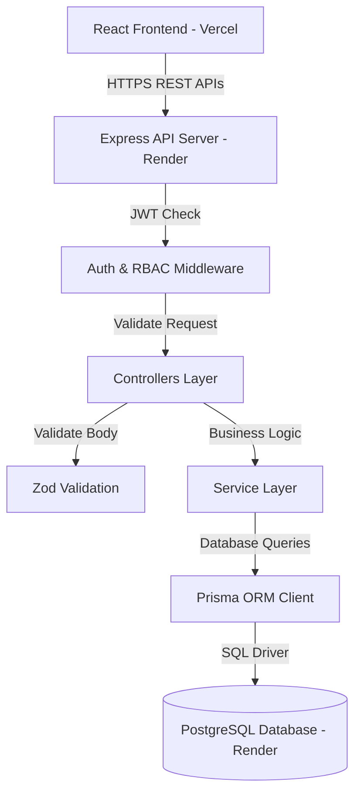
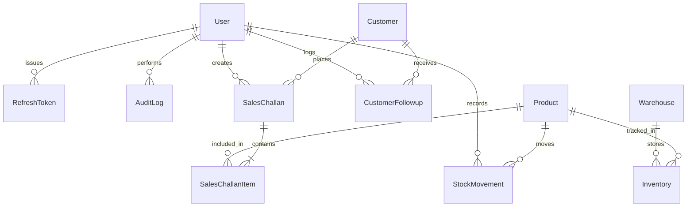
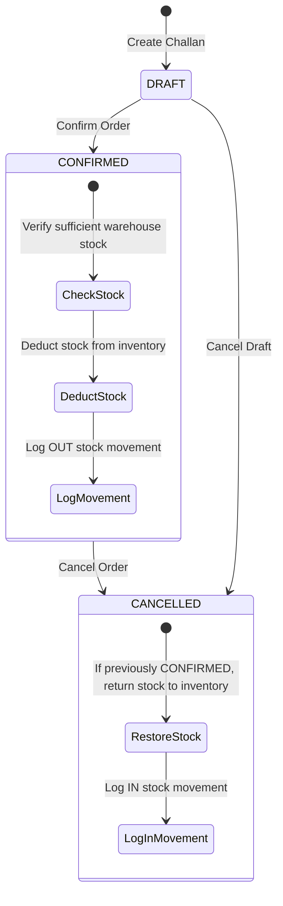

# Enterprise Mini ERP + CRM Operations Portal

A complete web application built for wholesale and distribution businesses to manage customer relationships, track warehouse stock, record follow-ups, and create sales challans with automated stock deduction.

- **Backend API & Database**: Hosted on **Render** (Node.js + PostgreSQL)
- **Frontend App**: Hosted on **Vercel** (React + Vite)

---

## 🔑 Demo Login Accounts

You can log in using any of these pre-configured accounts (or click the 1-click demo buttons on the login page):

| Role | Email | Password | Allowed Capabilities |
| :--- | :--- | :--- | :--- |
| **Admin** | `admin@minierp.com` | `Admin123!` | Full access to all pages, user management, audit logs, and record deletion |
| **Sales Exec** | `sales@minierp.com` | `Sales123!` | Manage customer CRM, log follow-up notes, and create sales challans |
| **Warehouse Lead** | `warehouse@minierp.com` | `Warehouse123!` | Manage product list and record manual stock adjustments (`IN` / `OUT`) |
| **Accounts Manager** | `accounts@minierp.com` | `Accounts123!` | View financial summaries, print invoices, and inspect security audit logs |

---

## 🛠️ Technology Stack

### Backend
- **Node.js** & **TypeScript**
- **Express.js** (structured into controllers, services, middlewares, and routes)
- **Prisma ORM** (PostgreSQL on Render for production, SQLite for local dev)
- **JWT & bcryptjs** (Secure login with short-lived access tokens and long-lived refresh tokens)
- **Zod** (Input request schema validation)
- **Winston & Morgan** (Logging)

### Frontend
- **React 18** & **TypeScript**
- **Vite** (Fast frontend build tool)
- **TanStack Query (React Query v5)** (Server state management and caching)
- **Tailwind CSS** (Clean UI styling)
- **Recharts** (Dashboard analytics charts)
- **Lucide Icons** (Icons)

---

## 📐 System Architecture & Data Flow

### Architecture Overview
The app uses a decoupled architecture where the React frontend hosted on **Vercel** talks to the Express REST API hosted on **Render**.



### Backend Directory Structure
```
backend/src/
├── config/             # Environment variables and configuration settings
├── controllers/        # Parses HTTP requests and sends structured responses
├── services/           # Core business logic (stock deduction rules, CRM rules)
├── validations/        # Zod input validation schemas
├── middlewares/        # Authentication, role permissions, rate limit, error handling
├── routes/             # Express API route definitions
├── utils/              # Helper utilities (JWT tokens, logger, standard API responses)
└── index.ts             # Server entry point
```

### Database Entity Relationships (ER Diagram)


### Core Business Workflows & Stock Deduction Logic



1. **Customer CRM**: Create customer profiles (Wholesale / Retail) with built-in GST & Email duplicate prevention. Add follow-up notes with scheduled dates.
2. **Manual Stock Adjustments**: Warehouse leads can log `IN` (stock received) or `OUT` (stock issued) movements with reasons. Products below minimum stock trigger red alert badges.
3. **Sales Challan Lifecycle**:
   - **Draft**: Create order drafts with multiple items. Stock is **not** deducted in draft mode.
   - **Confirmation**: When confirmed, the server checks stock availability for each item and deducts stock. If stock is insufficient, confirmation is blocked with a clear error.
   - **Price Snapshot**: Customer info and item prices are saved inside the challan record as a snapshot, so future master data edits never alter historical invoices.
   - **Cancellation**: Cancelling a confirmed challan returns the items back to warehouse stock automatically.

---

## 🔌 Complete API Documentation

### Base URLs
- **Local Development**: `http://localhost:5000/api`
- **Production Backend (Render)**: `https://minierp-backend.onrender.com/api`
- **Interactive Swagger Docs**: `http://localhost:5000/api-docs`

---

### 1. Authentication Endpoints

#### Login
- `POST /api/auth/login`
- **Request Body**:
  ```json
  {
    "email": "admin@minierp.com",
    "password": "Admin123!"
  }
  ```
- **Response**: Returns `user` object, `accessToken` (JWT 15 mins), and `refreshToken` (7 days).

#### Refresh Access Token
- `POST /api/auth/refresh`
- **Request Body**: `{ "refreshToken": "<refresh_token>" }`

#### Logout
- `POST /api/auth/logout`
- **Request Body**: `{ "refreshToken": "<refresh_token>" }`

---

### 2. Customer CRM Endpoints

#### List Customers
- `GET /api/customers`
- **Query Parameters**: `page`, `limit`, `search`, `customerType` (`WHOLESALE` / `RETAIL`).

#### Create Customer
- `POST /api/customers` *(Allowed Roles: `ADMIN`, `SALES`)*
- **Request Body**:
  ```json
  {
    "customerName": "Rajesh Shah",
    "businessName": "Apex Electronics Pvt Ltd",
    "email": "purchase@apexelectronics.com",
    "mobile": "+91 9820012345",
    "gstNumber": "27AAACA1234A1Z5",
    "customerType": "WHOLESALE",
    "address": "Industrial Hub, Mumbai"
  }
  ```

#### Log CRM Follow-Up
- `POST /api/customers/:id/followups` *(Allowed Roles: `ADMIN`, `SALES`)*
- **Request Body**:
  ```json
  {
    "notes": "Discussed Q3 inventory order terms.",
    "nextFollowupDate": "2026-08-01T10:00:00.000Z"
  }
  ```

---

### 3. Products & Stock Endpoints

#### List Products
- `GET /api/products`
- **Query Parameters**: `search`, `lowStock=true`.

#### Create Product
- `POST /api/products` *(Allowed Roles: `ADMIN`, `WAREHOUSE`)*
- **Request Body**:
  ```json
  {
    "name": "Industrial Router X500",
    "sku": "SKU-ROUT-500",
    "unitPrice": 4500.00,
    "minStock": 10,
    "unit": "PCS"
  }
  ```

#### Manual Stock Adjustment
- `POST /api/inventory/adjust` *(Allowed Roles: `ADMIN`, `WAREHOUSE`)*
- **Request Body**:
  ```json
  {
    "productId": "<product_uuid>",
    "quantity": 25,
    "movementType": "IN",
    "reason": "Shipment received from manufacturer"
  }
  ```

---

### 4. Sales Challan Endpoints

#### Create Sales Challan (Draft)
- `POST /api/challans` *(Allowed Roles: `ADMIN`, `SALES`)*
- **Request Body**:
  ```json
  {
    "customerId": "<customer_uuid>",
    "items": [
      {
        "productId": "<product_uuid>",
        "quantity": 5,
        "unitPrice": 4500.00
      }
    ],
    "notes": "Net 30 days payment term"
  }
  ```

#### Update Challan Status (Confirm / Cancel)
- `PATCH /api/challans/:id/status` *(Allowed Roles: `ADMIN`, `SALES`, `WAREHOUSE`)*
- **Request Body**: `{ "status": "CONFIRMED" }` or `{ "status": "CANCELLED" }`

---

### 5. Audit Logs & Dashboard

#### Executive Dashboard Summary
- `GET /api/dashboard/summary` — Returns total revenue, customer count, low stock alert count, and monthly sales data.

#### Audit Trail
- `GET /api/audit-logs` *(Allowed Roles: `ADMIN`, `ACCOUNTS`)* — Returns complete user action audit trail with timestamps and IP addresses.

---

## ⚡ Running Locally

### Requirements
- Node.js (v18+)
- npm (v9+)

### 1. Start Backend API & Seed Database

```bash
cd backend
npm install
npm run prisma:db:push
npm run prisma:seed
npm run dev
```
- API will start at `http://localhost:5000/api`
- Interactive Swagger docs available at `http://localhost:5000/api-docs`

### 2. Start Frontend Application

In a new terminal window:

```bash
cd frontend
npm install
npm run dev
```
- App will open at `http://localhost:5173`

---

## 🐳 Docker Deployment (Local / VPS)

To run the full stack (PostgreSQL + Express Backend + React Frontend) using Docker:

```bash
docker-compose up -d --build
```

- **Frontend**: `http://localhost`
- **Backend API**: `http://localhost:5000/api`
- **Swagger Docs**: `http://localhost:5000/api-docs`

---

## ☁️ Production Deployment Guide

We use **Render** for the backend API & PostgreSQL database, and **Vercel** for the frontend application.

### 1. Backend & PostgreSQL Database on Render

1. **Create Database**: Go to Render ➔ **New +** ➔ **PostgreSQL**. Name: `minierp-postgres`. Copy the **Internal Database URL**.
2. **Deploy Backend Web Service**: Go to Render ➔ **New +** ➔ **Web Service**.
   - **Root Directory**: `backend`
   - **Build Command**: `npm install && npm run render:build`
   - **Start Command**: `npm run render:start`
   - **Environment Variables**:
     - `NODE_ENV`: `production`
     - `PORT`: `10000`
     - `DATABASE_URL`: `<Render Internal Database URL>`
     - `JWT_ACCESS_SECRET`: `<Your secret key>`
     - `JWT_REFRESH_SECRET`: `<Your secret key>`
     - `CORS_ORIGIN`: `https://<your-vercel-app>.vercel.app`

---

### 2. Frontend Application on Vercel

1. Log in to [Vercel](https://vercel.com/) and click **Add New Project**.
2. Import your GitHub repository.
3. Configure settings:
   - **Root Directory**: Click Edit and select `frontend`.
   - **Framework Preset**: Vite (auto-detected).
   - **Build Command**: `npm run build`
   - **Output Directory**: `dist`
4. Add **Environment Variable**:
   - `VITE_API_BASE_URL`: `https://minierp-backend.onrender.com/api` *(Replace with your Render backend service URL)*
5. Click **Deploy**. Vercel will build and host your frontend app!

---

## 🧪 QA & Manual Testing Checklist

- [x] **Admin Login**: Test `admin@minierp.com` / `Admin123!`. Verify full system access, audit logs, and record deletion.
- [x] **Sales Executive**: Test `sales@minierp.com` / `Sales123!`. Verify CRM access, follow-up logging, and sales challan creation.
- [x] **Warehouse Lead**: Test `warehouse@minierp.com` / `Warehouse123!`. Verify stock adjustment capabilities (`IN`/`OUT`).
- [x] **Accounts Manager**: Test `accounts@minierp.com` / `Accounts123!`. Verify financial dashboards and printable invoices.
- [x] **Protected Routes**: Direct navigation to `/dashboard` while unauthenticated redirects to `/login`.
- [x] **Token Refresh**: Automatic seamless token refresh when access token expires.
- [x] **Customer Validation**: Attempt to add customer with duplicate GST or Email; verify system blocks duplicate.
- [x] **Low Stock Warning**: Products with stock <= minStock highlight with red alert badge.
- [x] **Stock Deduction**: Confirming a sales challan deducts stock. Attempting to confirm with insufficient stock returns clear error.
- [x] **Print Invoice**: Click Print/Export PDF on confirmed challan; verify clean printable invoice.

---

## 📄 License

This project is open-source under the MIT License.
