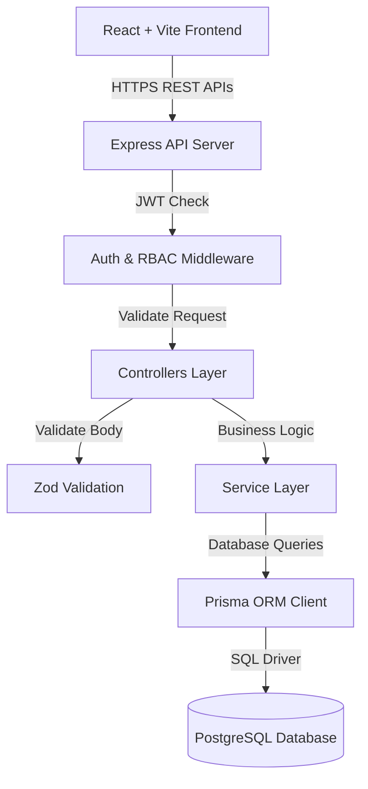
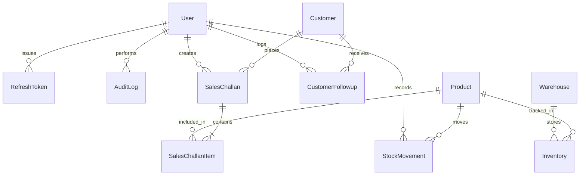
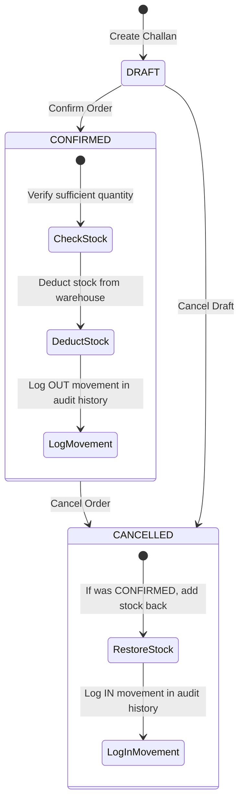

# System Architecture

This document explains how the Enterprise Mini ERP + CRM Portal is designed, how data flows through the application, and how key features work behind the scenes.

---

## 1. System High-Level View

The application uses a standard decoupled architecture with a React frontend communicating with an Express REST API backed by a PostgreSQL database.



---

## 2. Codebase Organization

The backend follows a layered structure to keep code clean and easy to test:

```
backend/src/
├── config/             # Environment variables and port settings
├── controllers/        # Parses HTTP requests and sends back responses
├── services/           # Core business logic (stock deduction rules, CRM rules)
├── validations/        # Request body validation schemas using Zod
├── middlewares/        # Authentication, role permissions, rate limiting, error handling
├── routes/             # URL route definitions
└── utils/              # Helper functions (JWT tokens, logger, standard API responses)
```

---

## 3. Database Entity Relationships

Here is how the main database tables connect with each other:



---

## 4. How Security & Roles Work

### Authentication
1. A user logs in with their email and password.
2. The server returns two tokens:
   - **Access Token**: Short-lived JWT (valid for 15 minutes) sent in the HTTP header for requests.
   - **Refresh Token**: Long-lived token (valid for 7 days) stored securely to generate new access tokens seamlessly when the old one expires.

### User Roles
- **ADMIN**: Access to all features, including system configuration, audit logs, and record deletion.
- **SALES**: Can manage customer details, log sales follow-ups, and generate sales challans.
- **WAREHOUSE**: Can edit product details and adjust warehouse stock levels (`IN` / `OUT`).
- **ACCOUNTS**: Can view financial summaries, print invoices, and review security audit logs.

---

## 5. Sales Challan & Stock Logic Flow

When a user works with a Sales Challan, stock levels update according to these rules:



1. **Creating a Draft**: A sales challan starts as `DRAFT`. In draft mode, product items are selected but warehouse stock is **not deducted**.
2. **Confirming a Challan**: When confirmed, the system checks whether enough stock exists for every line item.
   - If stock is available, it deducts the stock and logs an `OUT` stock movement.
   - If stock is missing, it cancels the transaction and returns a helpful error.
3. **Price & Customer Snapshots**: When a challan is created, the system saves a snapshot of product prices and customer details inside the challan. This ensures older invoices remain accurate even if prices or address details change in the future.
