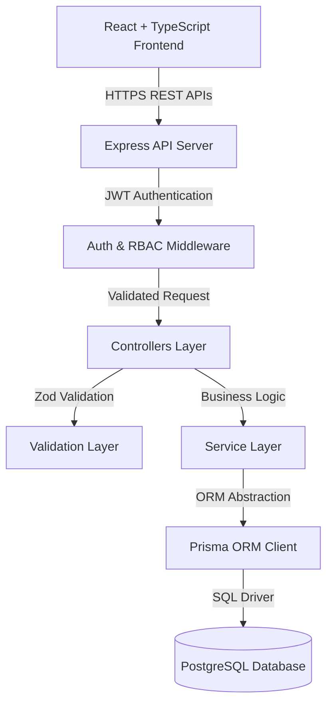
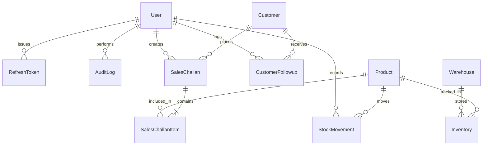
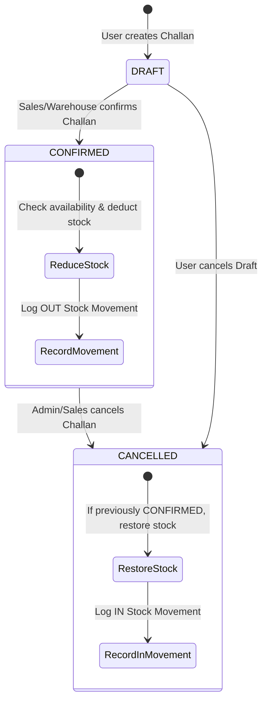

# Enterprise Mini ERP + CRM Portal — System Architecture Documentation

## 1. System Overview

The **Enterprise Mini ERP + CRM Operations Portal** is designed using **Clean Architecture** principles to support wholesale and distribution enterprise operations. The system cleanly separates business domain logic from data access and transport protocols, ensuring high maintainability, testability, and scalability.



---

## 2. Directory & Layer Organization

### Backend Layering (Clean Architecture / N-Tier)
```
backend/src/
├── config/             # Application environment configurations
├── controllers/        # Request handling, HTTP response formatting
├── services/           # Core domain business logic & state transitions
├── validations/        # Zod input request schema validations
├── middlewares/        # Security, Auth JWT, Role RBAC & Error handling
├── routes/             # Express API Endpoint definitions
├── utils/              # Standardized API response helpers, JWT, Logger, Prisma
└── types/              # Express & TypeScript declarations
```

---

## 3. Entity Relationship (ER) Diagram



---

## 4. Authentication & Authorization Flow

1. **Authentication**: Users log in with email and password via `POST /api/auth/login`. On verification, the server issues:
   - **Access Token**: Short-lived JWT (15 mins) carried in `Authorization: Bearer <token>` header.
   - **Refresh Token**: Long-lived token (7 days) stored in database and used via `POST /api/auth/refresh`.

2. **Role-Based Access Control (RBAC)**:
   - `ADMIN`: Global read/write, user registration, deletion, full audit logs.
   - `SALES`: Customer CRM management, follow-ups, Sales Challan generation.
   - `WAREHOUSE`: Product catalog, min stock levels, manual stock adjustments.
   - `ACCOUNTS`: Financial reports, Sales Challans audit, read-only customer records.

---

## 5. Key Business Workflows

### Sales Challan Lifecycle & Stock Deduction Logic



---

## 6. Scalability & Caching Strategy

- **Stateless API Layer**: API endpoints are stateless, enabling horizontal scaling using load balancers (AWS ALB, Nginx).
- **Database Connection Pooling**: Prisma manages PostgreSQL connection pooling efficiently.
- **Client-Side Query Caching**: React Query (TanStack Query) handles caching and background revalidation on the client.
- **Redis Cache Ready**: Redis layer can be added to cache high-frequency product lookup APIs (`GET /api/products`).
